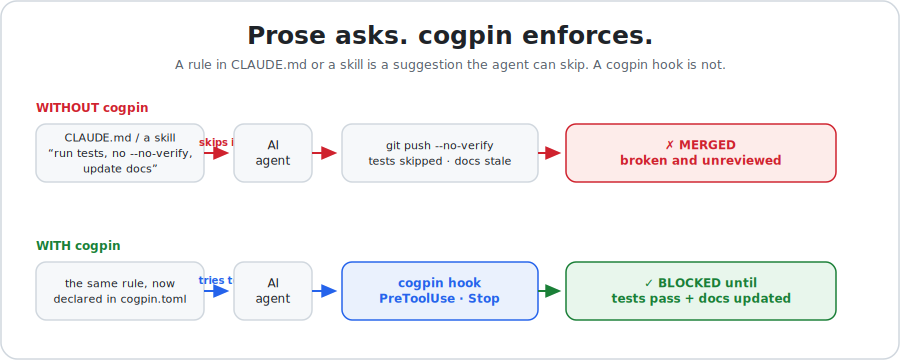
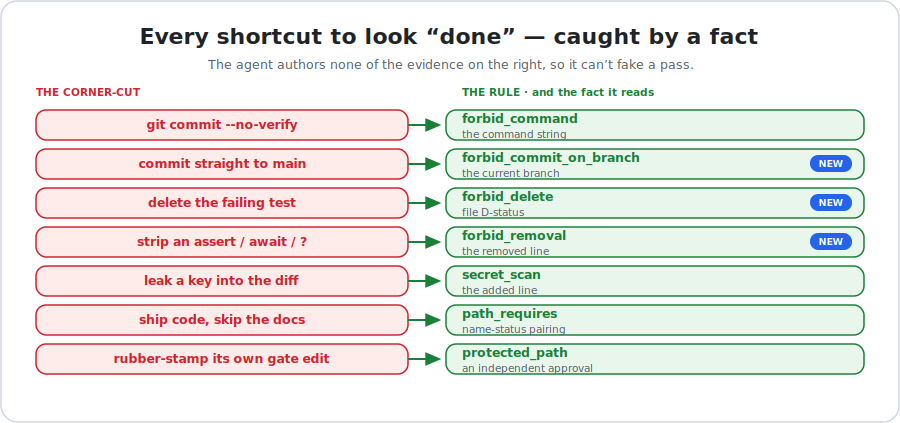
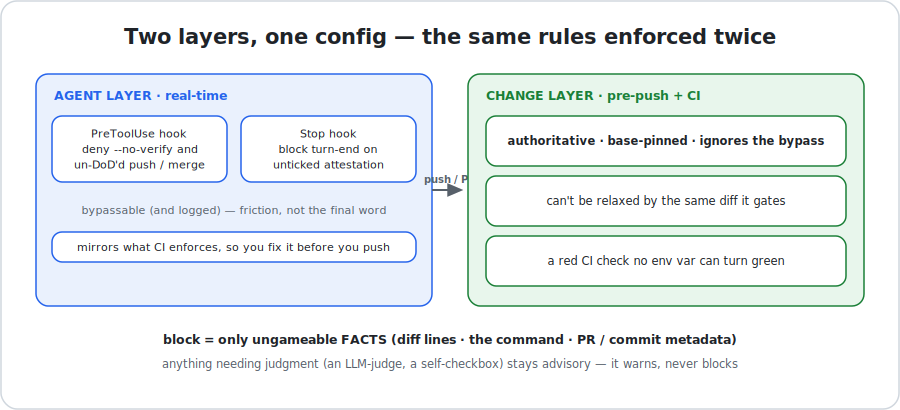
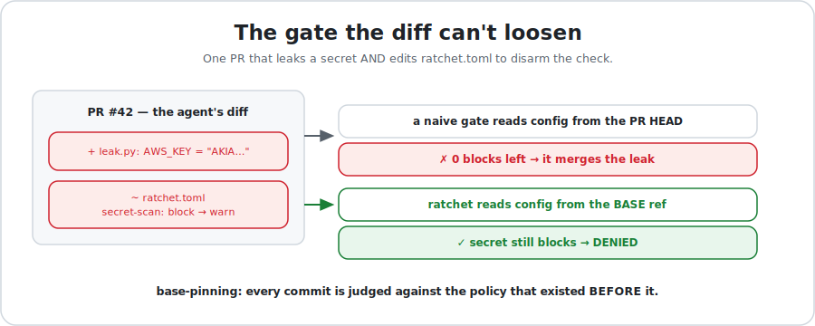

<p align="center"></p>
<h1 align="center">ratchet</h1>

<p align="center"><b>A Definition-of-Done gate for AI coding agents.</b><br>
Prose binds intention. Only mechanism binds behavior.</p>

<p align="center"></p>

When an AI agent closes a task it tends to skip the unglamorous last mile —
forgets the test, bypasses the hook with `--no-verify`, deletes the failing test
to go green, leaves the docs stale, or *says* it reviewed when it didn't. A
`CLAUDE.md` that says "always run the tests" is a suggestion the same model can
rationalize past. **ratchet turns that closing-discipline into a gate the agent
can't talk its way around** — a Claude Code plugin you install once.

It rests on one rule:

```
severity = "block"   REQUIRES   kind = "fact"
```

A **fact** decides only over things the agent can't fake — the normalized diff,
the command it's about to run, PR/commit metadata, reviewer approvals. Those may
hard-block. Anything that needs *judgment* (an LLM-judge, a self-attestation) is
**advisory** — it warns or nudges, never blocks. That single invariant is the
whole moat: a forgetful or over-confident agent can't pass a block it didn't
actually satisfy, because **it never authored the evidence the block reads.**

One language-agnostic engine, one per-repo `ratchet.toml`. The engine reads git
facts + your config; it never imports your project code. Anything
language-specific goes through the one `run` escape hatch. The engine itself is a
single stdlib-only `ratchet.py` — auditable in plain text, zero dependencies, no
package manager.

## What it catches

Every shortcut an agent takes to *look* done maps to a fact it can't author. The
right-hand column is the ungameable signal each rule reads:

<p align="center"></p>

The three **NEW** rules close the canonical "make CI green by doing less"
corner-cuts that pure pattern-matching is blind to — they extend the engine's
fact surface to the parts of a diff most gates never look at:

- **`forbid_removal`** — the `-` twin of `forbid_pattern`. A *removed* line
  matching a guard pattern (an `assert`, an `await`, an error-propagating `?`, an
  auth check, a `# nosec` / SPDX header) blocks. *"Silently delete the safety
  net"* is the most common AI corner-cut, and the one a content scanner of
  *added* lines cannot see.
- **`forbid_delete`** — file D-status guard. *"Delete the failing test to reach
  green."* Whole-file deletions under a scope block (with `unless_paired_add` to
  let a genuine rename/reorg through).
- **`forbid_commit_on_branch`** — the live-branch fact. *"Commit straight to
  main."* The `PreToolUse` hook denies a commit/push on a protected branch in
  real time; the only way past is `git checkout -b`, which is the intended
  outcome. (A `run` block can't substitute — it's not a real-time op-denier.)

## Why not just CLAUDE.md? (even nested, per-directory)

`CLAUDE.md` / `AGENTS.md` is the right tool for **intent** — architecture,
conventions, why a sharp edge exists. Keep it. But it is structurally incapable
of **enforcing** the closing-discipline, and writing more of it doesn't fix that:

1. **The reader is the violator.** The same model that reads "always run the
   tests" decides whether to. An instruction it can rationalize past ("trivial
   change, I'll test later") is a suggestion to itself, not a gate.
2. **Salience decays exactly when it matters.** Long sessions summarize and evict
   early context; a nested `CLAUDE.md` only loads when you touch that tree; big
   files get skimmed. Closing-discipline is needed at the *end* of a long task —
   precisely when the instruction is faintest.
3. **Prose can't reject an action.** It cannot return a non-zero exit code. The
   agent can run `git commit --no-verify` and no `CLAUDE.md` will stop the tool
   call. ratchet's `PreToolUse` hook *denies* it, in real time, before it runs.
4. **Self-report is gameable.** "I did a two-lens review" / "docs updated" is
   authored by the gated agent. A check that trusts the agent's own claim is no
   check. ratchet blocks only on facts the agent can't author.
5. **More prose ≠ more binding.** Splitting rules across many `CLAUDE.md` files
   improves locality of *intent*, not enforcement. Ten unenforced rules are
   bypassed as easily as one. You can't patch an enforcement gap with docs.
6. **The rulebook is editable in the same breath.** An agent can delete the
   "no `--no-verify`" line from `CLAUDE.md` in the very change that uses it.
   ratchet reads its policy from the pinned base ref — the gate you're under is
   the one that existed *before* your diff ([proof below](#why-its-bypass-proof)).

ratchet doesn't replace `CLAUDE.md`; it's the mechanism half of the idea your
`CLAUDE.md` already states.

## Two layers, one config

<p align="center"></p>

| Layer | Fires at | Authority |
|---|---|---|
| **agent** | Claude Code `PreToolUse` / `Stop` hook — real time | denies `--no-verify`, a commit/push on a protected branch, and a `git push` / `gh pr merge` whose DoD fails; `Stop` blocks turn-end on unticked attestation boxes. Bypassable via `[meta].bypass_env` (always logged) |
| **change** | git pre-push hook + CI | **authoritative** — base-pinned, ignores the bypass env |

The agent layer is *friction in real time* — it catches the cut at the moment the
agent reaches for it and mirrors what CI will enforce, so you fix it before you
push. The change layer is the *final word* — a red CI check no env var can turn
green.

## Install

The plugin runs two tiny Python lifecycle hooks, so `python3` (3.11+) needs to be
on your PATH — including the *non-interactive* shell's PATH for Nix/nvm-style
setups. If it isn't, nothing errors; the always-on gate just stays quiet.

### 1 · Add the plugin (Claude Code)

```
/plugin marketplace add IvanWng97/ratchet
```
```
/plugin install ratchet@ratchet
```
(Two separate prompts — send them one at a time.)

> The desktop app has no `/plugin` command: Customize → the `+` by personal
> plugins → Create plugin and add marketplace → Add from repository → the repo URL.

That gives you the **agent layer** immediately — the `PreToolUse` deny + `Stop`
nudge fire every session, and `/ratchet-init` / `/ratchet-check` become
available. "Default-on" means enforcement is a property of your client + the
repo, not a step the agent has to remember.

### 2 · Wire the change layer (once per repo)

The agent layer is per-developer; the authoritative **change layer** (pre-push +
CI, base-pinned, un-bypassable) is per-repo. Run once, inside Claude Code:

```
/ratchet-init
```

That single command runs `ratchet install` — vendors the single-file engine to
`.ratchet/ratchet.py`, scaffolds `ratchet.toml`, wires a pre-push managed block
into your effective hooks dir (coexisting with any husky/lefthook/pre-commit you
already run — it appends, never clobbers), and scaffolds
`.github/workflows/ratchet.yml` — then drafts a project-specific policy from your
`CLAUDE.md` house rules **as `ratchet.toml.draft` for you to review and rename**.
Commit `.ratchet/ratchet.py`, `ratchet.toml`, and the workflow, and every clone —
every agent, every PR — meets the same gate. Then `/ratchet-doctor` confirms both
layers are live. No npm, no package manager, no binary download — one
stdlib-Python file, committed.

The scaffolded CI is two steps over the composite action:

```yaml
permissions: { contents: read, pull-requests: read, checks: read }  # reviews/checks SKIP without these
jobs:
  ratchet:
    runs-on: ubuntu-latest
    steps:
      - uses: actions/checkout@v4
        with: { fetch-depth: 0 }          # base-pinning needs history
      - uses: IvanWng97/ratchet@v1         # rev-pinned engine over your base-pinned config
```

The action runs its **own rev-pinned `ratchet.py`** (not the repo's head-side copy)
over your **base-pinned `ratchet.toml`** — so a PR can neither rewrite the engine to
`exit 0` nor relax the policy in the same diff it's gated on. It also gathers the PR
facts (body, reviews, checks, approvals) so the reviewer-identity and checks-green
primitives work with zero extra config.

**Not on GitHub Actions?** The engine is the same everywhere. A teammate who wants
their *local* pre-push (CI already gates them) runs
`python3 .ratchet/ratchet.py install --no-vendor --no-config --no-ci`. On GitLab CI,
five lines do it: `GIT_DEPTH: 0`, `git fetch origin "$CI_DEFAULT_BRANCH"`, then
`python3 .ratchet/ratchet.py check` (PR-review facts degrade-to-skip off-GitHub).
Using **pre-commit**? It regenerates its own hook, so add a `repo: local` entry
pointing at the same vendored engine (`entry: python3 .ratchet/ratchet.py check`,
`stages: [pre-push]`) — `ratchet install` prints the exact snippet.

> **No Claude Code?** The change layer is tool-agnostic. Vendor the engine once
> without the plugin — pin a tag and fetch the one file, then `install --no-vendor`:
> ```sh
> mkdir -p .ratchet && curl -fsSL https://raw.githubusercontent.com/IvanWng97/ratchet/v1/ratchet.py -o .ratchet/ratchet.py
> python3 .ratchet/ratchet.py install --no-vendor   # wires hook + CI + gitignore
> ```
> It's a documented one-liner, not a bootstrapper to maintain — every later install
> re-runs the already-committed engine.

## Why it's bypass-proof

A `fact` block is only ungameable if the agent can't edit the gate **in the same
diff it's being gated on**.

<p align="center"></p>

1. **Base-pinning** — `ratchet.toml` (and your gate-defining files) are read from
   the pinned base ref, never the PR head. A same-PR edit that relaxes a check is
   evaluated against the *old* policy, so it can't disarm itself.
2. **`protected_path`** — changing those gate-defining files needs an independent
   approval, or the gate refuses.
3. **Isolated `run`** — invoke tools isolated (`ruff --isolated`, a pinned
   `pytest -c …`) so head-side config can't defang the teeth.

ratchet dogfoods itself. Here it refuses to be disarmed — one commit that adds a
secret **and** rewrites `ratchet.toml` to turn every block into a warn:

```console
$ python3 ratchet.py check                 # a clean commit
ratchet: ok (0 advisory warning(s))        # exit 0

$ printf 'AWS_KEY = "AKIA…EXAMPLE"\n' > leak.py          # leak a key, and…
$ sed -i 's/severity = "block"/severity = "warn"/' ratchet.toml   # …disarm the gate
$ grep -c 'severity = "block"' ratchet.toml
0                                      # HEAD's config now has ZERO blocks
$ git commit -am "feat: add module and 'tune' the gate"

$ python3 ratchet.py check
ratchet: definition-of-done NOT met (1 blocking)
  [BLOCK] secret-scan: possible secret in added line (leak.py)   # exit 1
```

The head-side `ratchet.toml` has no blocks left — yet the secret is still caught,
because the policy is read from the **base ref**. That is the difference between a
rule and a gate.

This isn't hypothetical — it's a documented failure class. Two reports against
Claude Code, in the maintainers' own tracker, name it exactly:

- [#32198](https://github.com/anthropics/claude-code/issues/32198) — *"Claude
  Code skips mandatory rules in CLAUDE.md (**Definition of Done**)"*
- [#40117](https://github.com/anthropics/claude-code/issues/40117) — *"Agent
  bypasses git pre-commit hooks using `--no-verify` … **despite explicit deny
  rules**"*

Both describe a prose rule the agent read and then ignored. That is precisely the
gap ratchet closes: a prose rule *asks*; ratchet makes the unwanted outcome a
non-event — the `--no-verify` call is denied before it runs, and the skipped step
reds a gate it can't edit.

## The primitive library

Every check reads only facts — never your code.

23 primitives — full reference in [`SCHEMA.md`](SCHEMA.md); the provenance of each
(first-principles vs mined from real AI-authored failures) is in
[`docs/coverage-map.md`](docs/coverage-map.md).

| primitive | kind | decides over |
|---|---|---|
| `forbid_command{pattern,deny}` | fact | the agent's command string — `deny` matches the **normalized** verb, defeating `git -C/p push` / `cd d && …` / `env X=Y …` wrappers (agent layer) |
| `forbid_commit_on_branch{branch,ops}` | fact | the live current branch (agent layer) |
| `self_protect{paths}` | fact | a live Write/Edit to a gate-defining file — the real-time twin of `protected_path` (agent layer) |
| `secret_scan{forbid_paths,custom}` | fact | added lines vs token shapes + forbidden file globs |
| `forbid_pattern{pattern,scope,exempt,strip_comments}` | fact | **added** lines under a path scope |
| `forbid_removal{pattern,scope,exempt,strip_comments}` | fact | **removed** lines under a path scope |
| `forbid_delete{scope,unless_paired_add,exempt}` | fact | per-file D-status (a deletion under scope) |
| `scope_lock{allow}` | fact | every A/M/D path must be inside the allowlist (scope creep) |
| `numeric_floor{key,direction,floor}` | fact | a numeric value's **direction** across the diff (lower coverage / raised retries / shortened timeout) |
| `change_budget{max_added,max_removed,max_files,max_file_added,scope}` | fact | count ceilings over the diff (blast radius) |
| `file_must_contain{scope,pattern,status}` | fact | every added/changed file in scope must add a matching line (e.g. an SPDX header) |
| `max_added_file_bytes{maxkb,allow_binary,scope}` | fact | per-file byte ceiling on added/modified files (vendored bundles, stray binaries) |
| `path_requires{when,need}` | fact | name-status: if `when` changed, `need` must too |
| `cooccur{trigger,require}` | fact | if `trigger` appears (diff/PR), `require` must too |
| `marker_present{marker,when}` | fact | a marker block exists in the PR body |
| `forbid_in_message{tokens,msg_scope}` | fact | forbidden tokens in a commit/PR message (e.g. `[skip ci]`) |
| `require_message_pattern{pattern,msg_scope}` | fact | every commit/PR message must match a shape (e.g. Conventional Commits) |
| `commit_footer{}` | fact | every commit ends with `[meta].commit_footer` |
| `protected_path{paths,require_approval}` | fact | gate-defining files changed → need an independent approval |
| `require_approval_from{paths,require_approval_from,exclude_author}` | fact | a change under `paths` needs an APPROVED review from a named owner (CODEOWNERS-lite; CI) |
| `pattern_requires_approval{pattern,scope,exclude_author}` | fact | an added line matching `pattern` (a new dep, an `unsafe`) needs an independent approval (CI) |
| `approval_state_depth{require_fresh,no_changes_requested,disallow_author,disallow_bot,min_approvals}` | fact | the approval is fresh (on head), human, non-author, with no outstanding changes-requested (CI) |
| `require_checks_green{need}` | fact | every (required) status check concluded `success` (CI) |
| `run{cmd}` | fact\* | shell-out; the exit code is the fact (**`block` only at the change layer**) |
| `attest{box,class}` | advisory | a class-gated `Stop`-hook checklist box — blocks turn-end until ticked (forcing function; the change layer is the ungameable gate) |
| `judge{prompt}` | advisory | an advisory LLM-judge prompt (CI `continue-on-error` substance check) |

### What it does and doesn't claim

ratchet guarantees the **forcing function**, not omniscience. A `fact` block can't
be talked past — that's the strong claim, and it holds. But `secret_scan` is
best-effort pattern matching (pair it with `gitleaks` via a `run` block for
depth); `forbid_removal`/`forbid_pattern` are presence-ungameable but
value-gameable (`assert!(true)` satisfies a naive "has an assert"); `attest` /
`judge` are advisory by construction; and a determined human with repo-admin
rights can always change the base policy through review. The line ratchet draws:
**anything an agent can do mid-task to cut a corner, it stops; anything that needs
human judgment stays advisory and visible.** That boundary is enforced by the
schema itself (`block` requires `fact`), so the guarantee can't silently erode.

## Config & recipes

Let `/ratchet-init` draft a policy from your `CLAUDE.md`, or start from a scaffold:

```
python3 ratchet.py install    # vendor + scaffold + hook + CI (or /ratchet-init in Claude Code)
python3 ratchet.py suggest    # repo facts → a ranked draft policy (CLAUDE.md house-rules → primitives)
python3 ratchet.py draft-lint # gate ratchet.toml.draft (the moat + outstanding review markers) before the rename
python3 ratchet.py gaps       # which CLAUDE.md rules are still prose with no mechanism
python3 ratchet.py doctor     # diagnose both layers (or /ratchet-doctor)
python3 ratchet.py validate   # checks the block-requires-fact invariant + structural sanity
```

The AI drafts to `ratchet.toml.draft`, never the live config; only the five
safe-core blocks may be born enforcing, and `draft-lint` blocks the rename until
every other block carries a cleared `# TODO(ratchet:review)` marker — the human's
`mv …draft …toml` is the sign-off.

Ready-to-lift policies:

- [`examples/pixtuoid/ratchet.toml`](examples/pixtuoid/ratchet.toml) — a faithful
  port of an 890-line bespoke DoD gate (Rust workspace) into 22 declarative checks.
- [`examples/node-ts/ratchet.toml`](examples/node-ts/ratchet.toml) — a Node/TS repo,
  including the team / PR-review layer (CODEOWNERS-lite, fresh-approval, checks-green).
- [`examples/python/ratchet.toml`](examples/python/ratchet.toml) — a Python repo.
- [`examples/advisory/ratchet.toml`](examples/advisory/ratchet.toml) — the advisory
  **judge** library: the eight semantic-weakening prompts (assertion-loosening,
  fake-impl, regex-relaxing, guard-removal, …) a diff fact can't prove, mined from
  real AI-authored PR history. Compose them with the blocking facts above.

ratchet dogfoods itself — see [`ratchet.toml`](ratchet.toml): its own change layer
re-runs its own test suite from the base-pinned policy; `self-protect` denies an
in-session edit to the gate files; `branch-first` + `keep-tests` + `no-test-delete`
guard this very repo with the primitives it ships.

## Docs

- **Tutorial + live playground** (the real engine in your browser via Pyodide):
  <https://ivanwng97.github.io/ratchet/>
- **[`SCHEMA.md`](SCHEMA.md)** — every config key and primitive field.
- **[`docs/coverage-map.md`](docs/coverage-map.md)** — every corner-cut class, the
  primitive that gates it, and the real PR/commit evidence behind it.
- **[`CONTRIBUTING.md`](CONTRIBUTING.md)** · **[`SECURITY.md`](SECURITY.md)** ·
  **[`CHANGELOG.md`](CHANGELOG.md)** · **[`CLAUDE.md`](CLAUDE.md)** (the dogfood agent guide).

## Status

v0.1 — engine (23 primitives) + Claude Code plugin (agent layer) + one-command
`/ratchet-init` wiring (`install` / `uninstall` / `doctor`) + AI-assisted config
draft (`suggest` / `draft-lint` / `gaps`) + a rev-pinned composite GitHub Action
(change layer) + tutorial site. Stdlib Python (3.11+), no third-party deps, no
package manager. MIT.
